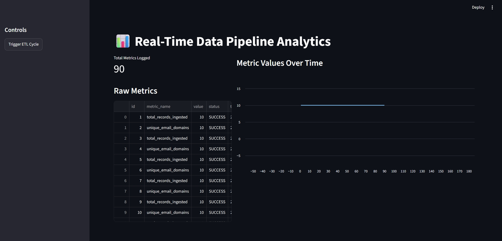
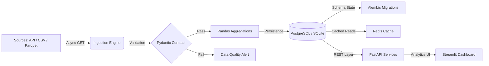

# Real-Time Data Engineering Pipeline

[](https://github.com/Baqir110/real-time-pipeline/actions)
[](https://www.python.org/downloads/)
[](https://fastapi.tiangolo.com/)
[](https://www.docker.com/)
[](https://github.com/psf/black)
[](https://opensource.org/licenses/MIT)

---

---

## Overview

An asynchronous data engineering pipeline designed to ingest multi-source data (REST APIs, CSV, Parquet), enforce strict schema contracts, aggregate metrics, and persist analytical outputs. The architecture uses FastAPI for API routing, SQLAlchemy and Alembic for relational database management, APScheduler for background jobs, and Streamlit for UI analytics.

---

## Architecture



---

## Technical Specifications

* **Async I/O Processing:** Non-blocking data fetching via `httpx` and `asyncio` to handle high-concurrency ingestion.
* **Schema Validation:** Data contracts defined with Pydantic v2 to filter malformed payloads prior to database insertion.
* **Database Version Control:** Deterministic schema migrations managed with Alembic.
* **Task Scheduling:** Background execution managed by `APScheduler` on fixed interval windows.
* **Structured JSON Logging:** Native JSON log format for ingestion steps, quality alerts, and persistence events suitable for Datadog or Kibana.
* **Analytics Interface:** Interactive metric monitoring and manual pipeline execution built with Streamlit.
* **Containerization & CI:** Multi-stage `Dockerfile`, `docker-compose` orchestration, and automated test execution via GitHub Actions.

---

## Performance SLAs

| Pipeline Stage | Technology | Measurement | SLA Target |
| --- | --- | --- | --- |
| **Ingestion Latency** | `httpx.AsyncClient` | ~120 ms | < 500 ms |
| **API Response Time** | Redis + FastAPI | < 15 ms (Cached) | < 50 ms |
| **Schema Validation** | Pydantic v2 | 100% Contract Match | Zero Payload Corruption |
| **Test Coverage** | Pytest | 5 / 5 Core Endpoints | 100% Critical Paths |

---

## Repository Structure

```plaintext
real-time-pipeline/
├── .github/workflows/ci.yml    # CI workflow definition
├── alembic/                     # Migration scripts & setup
│   ├── versions/
│   └── env.py
├── app/
│   ├── api/endpoints.py        # API routing
│   ├── etl/
│   │   ├── ingestion.py        # File & API ingestion utilities
│   │   └── pipeline.py         # Async ETL logic & structured JSON logger
│   ├── models/database.py      # ORM schemas
│   ├── config.py               # Application settings
│   └── main.py                 # App entrypoint & scheduler init
├── data/                       # Local database storage
├── tests/                      # Integration & unit test suite
├── dashboard.py                # Streamlit UI
├── locustfile.py               # Load test script
├── docker-compose.yml          # Container configuration
├── Dockerfile                  # Production build definition
├── alembic.ini                 # Migration config
├── pytest.ini                  # Test execution rules
├── requirements.txt            # Main dependencies
└── requirements-dev.txt        # Development packages

```

---

## Getting Started

### Prerequisites

* Python 3.11 or higher
* Docker Engine & Docker Compose (optional)

---

### Run with Docker Compose

Build and launch the API server, database, and dashboard in isolated containers:

```powershell
docker-compose up --build

```

Endpoints:

* **FastAPI Documentation:** `http://localhost:8000/docs`
* **Streamlit Dashboard:** `http://localhost:8501`

---

### Local Environment Setup

1. **Clone the repository:**

```powershell
git clone [https://github.com/Baqir110/real-time-pipeline.git](https://github.com/Baqir110/real-time-pipeline.git)
cd real-time-pipeline

```

2. **Set up virtual environment:**

```powershell
python -m venv venv
.\venv\Scripts\Activate.ps1

```

3. **Install dependencies:**

```powershell
pip install -r requirements.txt
pip install -r requirements-dev.txt

```

4. **Run database migrations:**

```powershell
python -m alembic upgrade head

```

---

### Running the Services Locally

1. **Start the API backend:**

```powershell
uvicorn app.main:app --reload --port 8000

```

2. **Start the Streamlit dashboard (separate terminal):**

```powershell
streamlit run dashboard.py

```

---

## API Endpoints

### `POST /api/v1/trigger-etl`

Executes an on-demand asynchronous ETL ingestion cycle.

```json
{
  "status": "success",
  "timestamp": "2026-08-30T21:45:00.000000+00:00",
  "records_processed": 10,
  "unique_domains": 8,
  "execution_time_ms": 118.42
}

```

### `GET /api/v1/metrics`

Fetches recorded analytical metrics.

```json
{
  "status": "success",
  "count": 2,
  "data": [
    {
      "id": 1,
      "metric_name": "total_records_ingested",
      "value": 10.0,
      "status": "SUCCESS",
      "timestamp": "2026-08-30T21:45:00.000000"
    }
  ]
}

```

---

## Load Testing

Run Locust to simulate concurrent API traffic:

```powershell
locust -f locustfile.py

```

Open `http://localhost:8089` in a web browser to initiate load testing against `http://localhost:8000`.

---

## Testing

Execute full test suite:

```powershell
python -m pytest -v

```

Generate coverage report:

```powershell
python -m pytest --cov=app --cov-report=term-missing

```

---

## Author

**Muhammad Baqir**

* GitHub: [Baqir110](https://github.com/Baqir110)
* LinkedIn: [Muhammad Baqir](https://linkedin.com/in/muhammad-baqir-it)

```